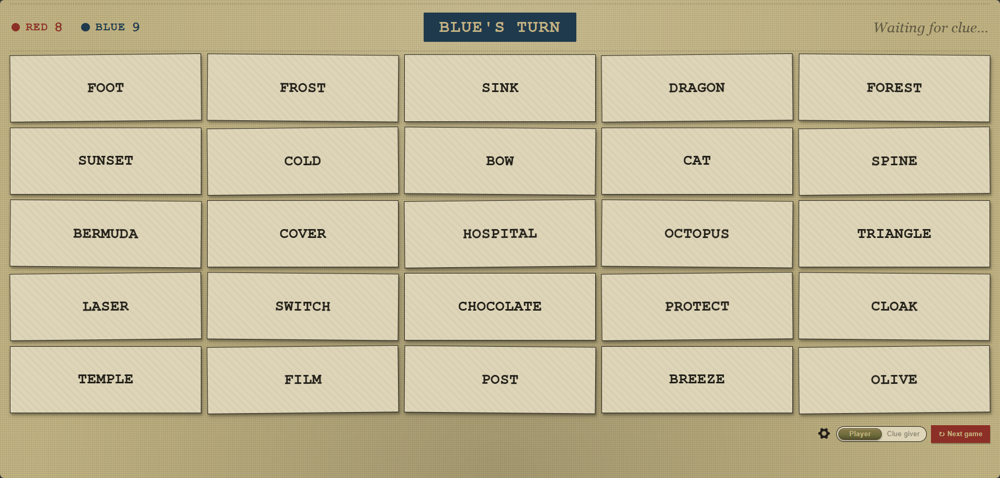
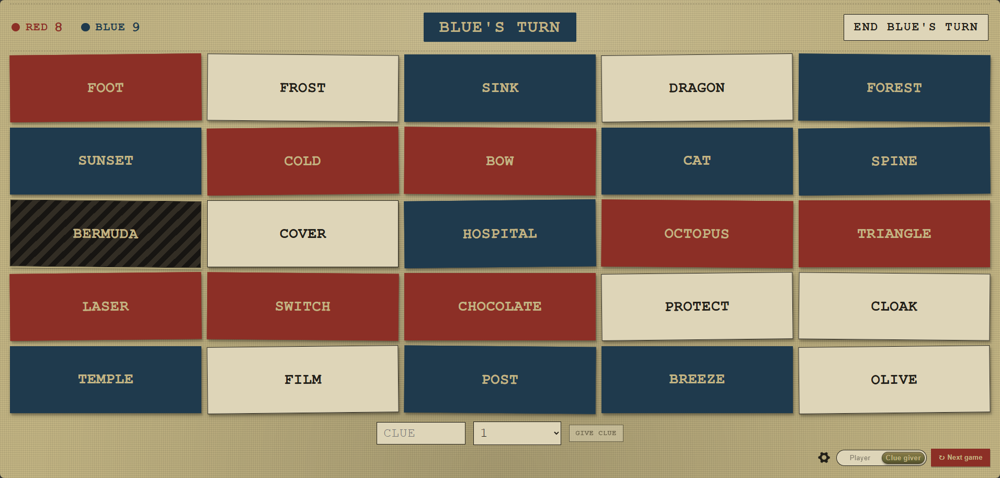

# Codenames

> **Disclaimer:** My background is in infrastructure, platform, and networking, not development. Every change in this fork -- design, code, testing -- was written and implemented by [Claude Code](https://claude.com/claude-code).

Codenames is a word-guessing game. Generated boards are shareable and sync. The board can be viewed either as a clue giver or a word guesser.

This is a personal fork of [jbowens/horsepaste](https://github.com/jbowens/horsepaste), rebranded and extended for self-hosting. See [Fork changes](#fork-changes) below for everything that's different from upstream.

## How I use this at parties

This has replaced the physical board game for me, and it's worked great for game nights. Player view goes up on a TV so the board is big enough for everyone in the room to see and shout guesses at, not just the people sitting closest. Both teams' clue givers sit elsewhere in the room sharing an iPad on the clue giver view and effectively run the game from there -- entering clues, locking in their team's card picks, and manually ending the turn when they're done or want to skip the bonus guess. Everyone ends up actually playing, not just watching two people huddle over a board -- no more waiting for your turn to hunch over a table squinting at the cards.

| Player view (TV) | Clue giver view (iPad) |
| --- | --- |
|  |  |

A prebuilt image is published to GHCR on every push to `master` (see `.github/workflows/docker-ghcr.yml`); `docker-compose.yml` pulls `ghcr.io/adl101010/codenames:latest` directly. The image builds `linux/amd64` only.

## Fork changes

Everything below is specific to this fork; none of it exists upstream.

### Gameplay

- **Real clue-giving mechanics** — clue word + number, with a confirmation step, guess quota, one bonus guess, and instant turn-ending on a wrong guess or the black card.
- **Roles are enforced** — only the clue giver can pick cards or end a turn; players just watch, with a 3D flip animation revealing each card.
- **A live, pausable timer** — turn on mid-game from the settings menu (not just at creation), and the clue giver can pause/resume it anytime.
- **Mature word filter** — off by default, capped at 4 mature words per board when enabled.
- **Bigger word bank** — English-only, with Valorant, CS2, and WoW words mixed in.

### Visual design

- **"Field Dossier" theme** — a vintage classified-document look across the whole app.
- Physical-style slide toggle for switching between player and clue giver.
- Confirmation dialogs sized generously for touchscreen use.
- Full-screen mode on by default.
- General contrast and legibility polish throughout.

### Hosting / ops

- Rebranded from "horsepaste"; all tracking/analytics removed — fully local, no third-party calls.
- `docker-compose.yml` for [Dockge](https://github.com/louislam/dockge) deployment.
- Sends `Cache-Control: no-store` so a CDN/tunnel in front of the deployment can't serve a stale page after a new image is deployed.
